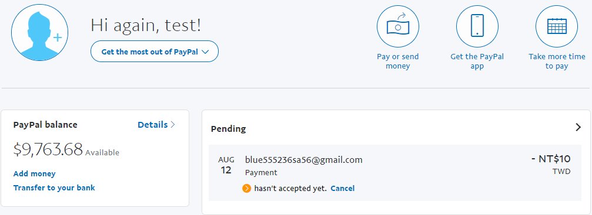
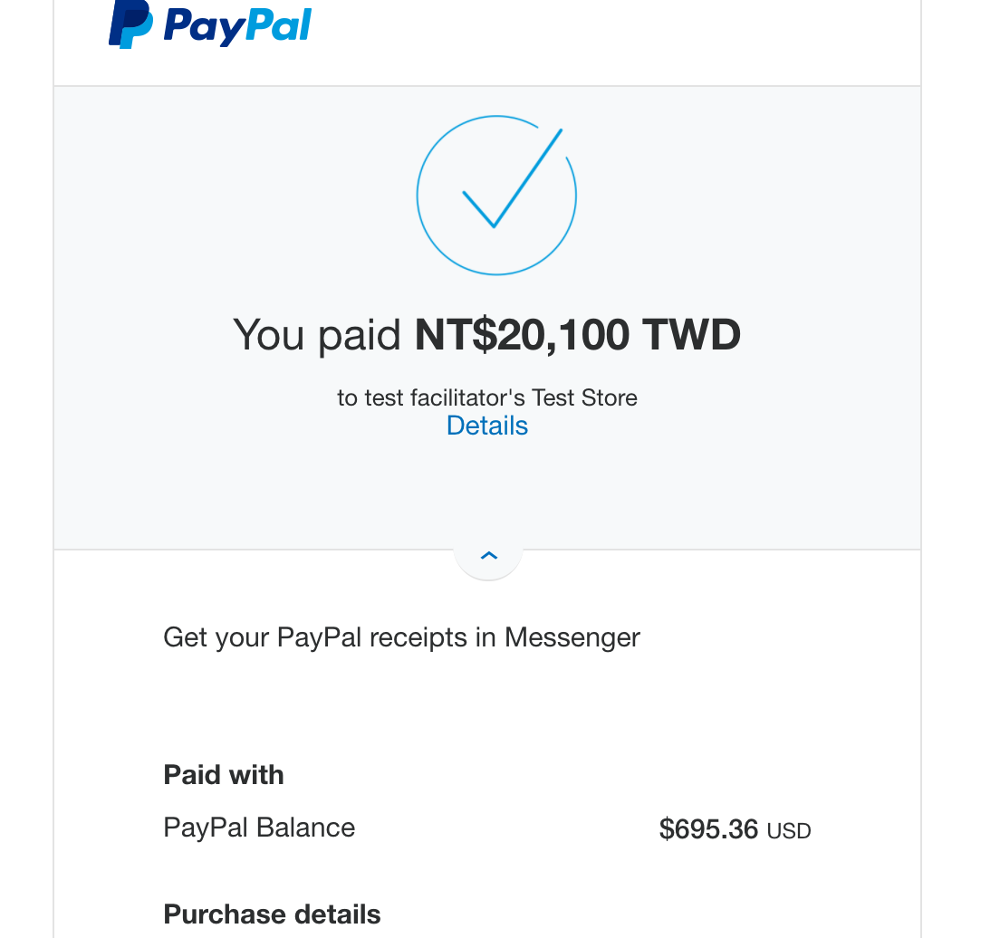

# Django_Shop ✨

* and E-commerce website using Python,Django,RestFramework,html,Css

# Features

* 🛒 Product Management : Ability to add, edit and delete products easily by store managers.
    Display full product details including pictures, prices and descriptions.

* 📦 Shopping cart system : Ability to add and remove & update quantity products from the shopping cart.
    Calculating the total purchase cost by considering the number and price of products.

* 💳 Secure Payment gateway : Connect to PayPal payment gateway for safe and secure transactions.
    Support online payments using credit cards and PayPal account.

* 📊 Sales Analytics: Gain valuable insights into your business's performance and make data-driven decisions.

----

# Getting Started

- Getting started with Django-Store is very easy. Follow the steps below to set up your e-commerce platform:

1. **Clone the Repository:** 

       git clone https://github.com/amirhoseinshojaei/Django_shop.git

2. **Navigate to the Project:**

        cd Django_shop

3. **Create and activate a VIRTUAL ENVIROMENT:**

        virtualenv venv

        source venv/bin/activate  

- on windows:

      venv\scripts\activate

4. **Install Required Dependencies:**

        pip install -r requirements.txt

5. **Apply Database Migrations:**

        python manage.py migrations

6. **Create a Super User:**

        python manage.py createsuperuser

7. **Start the Development System:**

       pyhton manage.py runserver

8. **Access the Admin Panle:**

* http://localhost:8000/admin

----

# API

**Get a list of products:**

- http://localhost:8000/rest_shop/products/

**Get a list of categories:**

- http://localhost:8000/rest_shop/category/

**Get a list of Cart:**

- http://localhost:8000/rest_cart/cart/

----

# Context Processors

        TEMPLATES = [
    {
        'BACKEND': 'django.template.backends.django.DjangoTemplates',
        'DIRS': [os.path.join(BASE_DIR, 'templates')],
        'APP_DIRS': True,
        'OPTIONS': {
            'context_processors': [
                'django.template.context_processors.debug',
                'django.template.context_processors.request',
                'django.contrib.auth.context_processors.auth',
                'django.contrib.messages.context_processors.messages',
                'cart.context_processors.cart', #add this 🖌️
            ],
        },
    },

----

# PayPal

----

# Panel Admin

- Paypal IPns

----

# My Shop

- http://localhost8000/shop/products/

- Detial Product

- Book category 

- http://localhost8000/cart/

- http://localhost:8000/orders/create/

----

**Test Paypal:**

----

# HAPPY MOOD

**Be happy and Enjoy this project , And Always learning😎**

**You make me very happy by forking and committing to the project🤩**

----

# License

<a href="https://github.com/amirhoseinshojaei/Django_shop?tab=GPL-3.0-1-ov-file#GPL-3.0-1-ov-file">Click here</a>

